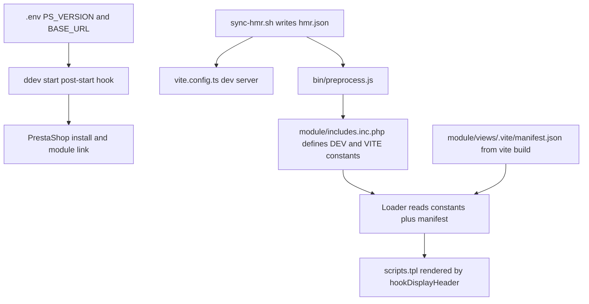

# Developer Experience Audit

A prioritized list of improvements for [`ps-vite-typescript`](../README.md), based on a read-through of the
build scripts, Vite/DDEV configuration, PHP module classes, CI workflows and documentation.

Scope: everything that affects the day-to-day loop of a developer working in this repository —
first-run bootstrapping, local feedback speed, correctness signals in CI, and discoverability of the
conventions this boilerplate depends on.

Legend for priority:

- **P0** — actively costs a developer time, hides failures, or ships broken output.
- **P1** — friction that shows up on most sessions or makes contributions riskier than they need to be.
- **P2** — polish and documentation gaps.

---

## P0 — Fix first

### 1. Build failures are silently swallowed

[`bin/build.js`](../bin/build.js:68) catches every error, logs it and returns normally, so
`bun run build` and `bun run build:zip` exit with status `0` even when Vite, Composer or the zip
step failed. Both [`release.yml`](../.github/workflows/release.yml:30) and
[`prestashop-validator.yml`](../.github/workflows/prestashop-validator.yml:22) then proceed to
publish or validate nothing, and a local developer sees a green `build` next to a stale
`module/views/`.

Fix: set `process.exitCode = 1` in the catch block and let the process end, or rethrow.

### 2. Resolved — `module/composer.json` key placement

`config` and `type` now sit at the root of [`module/composer.json`](../module/composer.json:23), so
Composer honours `prepend-autoloader` and `prestashop-module`.

What the fix exposed is the version drift this file participates in: `0.0.1` here, `0.0.1` in
[`package.json`](../package.json:4), `PLUGIN_VERSION=1.0.1` in [`.env`](../.env:29) and
`$this->version = '0.0.1'` in [`prestashopvite.php`](../module/prestashopvite.php:25). Four files, two
values, no single source of truth. Tracked as item 25.

### 3. `module/composer.json` is invalid JSON for the intent — no autoload for controllers

`classmap: ["prestashopvite.php", "controllers/"]` resolves relative to the package root
([`module/composer.json`](../module/composer.json:18)), which works, but the front controller in
[`module/controllers/front/show.php`](../module/controllers/front/show.php:11) defines a class name
(`prestashopviteshowModuleFrontController`) that only PrestaShop's own loader finds. Nothing documents
that controllers are *not* autoloadable, so contributors add `use` statements that fail at runtime.
Either document the rule in the module's README section, or add a PHPUnit autoload test that asserts
the class exists after `composer dump-autoload`.

### 4. `tsc` never checks the files most likely to break

[`tsconfig.json`](../tsconfig.json:26) has `"include": ["src", "dist"]`. That excludes
[`vite.config.ts`](../vite.config.ts:1), [`playwright.config.ts`](../playwright.config.ts:1),
[`tests/`](../tests/integration/playwright.test.js:1), [`bin/`](../bin/build.js:1) and
[`environment.d.ts`](../environment.d.ts:1), so `bun run build` type-checks only `src/`. It also
*includes* `dist`, which is build output and should never be type-checked.

Fix: `"include": ["src", "*.ts", "tests", "bin", "environment.d.ts"]`, `"exclude": ["dist", "node_modules", ".ddev"]`,
plus a dedicated `typecheck` script so the check is runnable without a full build.

### 5. The `@` alias is one-sided

[`vite.config.ts`](../vite.config.ts:96) registers `@` → `./src`, but
[`tsconfig.json`](../tsconfig.json:1) has no `paths` mapping. The alias is currently unused, so the
breakage is latent — the first developer who writes `import x from '@/front/api'` gets a red squiggle
and a failing `tsc` while the Vite build still resolves it. Add the matching `paths` entry, ideally
alongside a `baseUrl`.

### 6. PHP 8.2 dynamic property in the resource loader

[`Loader::__construct()`](../module/src/Classes/Vite/Loader.php:57) assigns `$this->configuration`
without declaring the property, which raises a deprecation on PHP 8.2+, and calls
`new Configuration()` on what is an abstract PrestaShop class — a fatal error if that branch is ever
reached. The property is also never read. Remove the block or declare the property and use the
framework's container instead of instantiating `Configuration`.

### 7. `stancer/php-stubs-prestashop` is installed but unused

[`module/composer.json`](../module/composer.json:25) pulls in PrestaShop stubs for static analysis,
but there is no PHPStan or Psalm configuration anywhere in the repository, so the dependency does
nothing. Either add `phpstan/phpstan` with a config that points at `module/src` and the stubs, or
drop the dependency.

---

## Second pass — findings in the PHP classes

Found while re-reading [`ApiControllerTrait`](../module/src/Traits/ApiControllerTrait.php:1),
[`ViteModuleTrait`](../module/src/Traits/ViteModuleTrait.php:1),
[`ViteFrontController`](../module/src/Classes/ViteFrontController.php:1),
[`JavascriptModuleManager`](../module/src/Classes/JavascriptModuleManager.php:1),
[`Admin/IndexController`](../module/src/Controllers/Admin/IndexController.php:1) and
[`Loader`](../module/src/Classes/Vite/Loader.php:1). These are the files a template user copies first
and the ones with the least test coverage.

### S1. P0 — every JSON API response exits with status `1`

[`ApiControllerTrait::sendResponse()`](../module/src/Traits/ApiControllerTrait.php:16) ends with
`die(1)`. The argument to `die()` is the process exit status, so each successful request terminates
PHP with a failure code. That breaks anything that inspects the exit status, skips PrestaShop's
shutdown handlers — session and cookie writes, profiling, `Hook::exec('actionShopDataDuplication')`
style teardown — and makes the trait impossible to unit test without forking.

Fix: `exit;` at the very least, or better, return the `JsonResponse` and let the caller send it. The
trait is also missing `declare(strict_types=1)` and a type for `$headers`.

### S2. P0 — two competing `getModuleConstant()` implementations

[`ViteModuleTrait::getModuleConstant()`](../module/src/Traits/ViteModuleTrait.php:5) is `private` and
returns `strtoupper($this->name)`, while
[`PrestashopVite::getModuleConstant()`](../module/prestashopvite.php:81) is `public` and returns
`str_replace('-', '_', strtoupper($this->name))`. PHP gives class methods precedence over trait
methods, so the trait copy never runs — silently. Meanwhile
[`Loader::__construct()`](../module/src/Classes/Vite/Loader.php:35) calls `$module->getModuleConstant()`
on whatever object it is handed, making this an implicit interface that only fails at runtime when
someone passes a module without the trait.

Fix: keep one public implementation, declare a small interface for the contract and have `Loader`
type-hint it (or document the requirement). The unused `isDev()` in the same trait should go too,
since [`Loader`](../module/src/Classes/Vite/Loader.php:36) implements its own variant.

### S3. P0 — `JavascriptModuleManager` narrows a parent method to `private`

[`JavascriptModuleManager::getSanitizedAttribute()`](../module/src/Classes/JavascriptModuleManager.php:15)
is declared `private` while `JavascriptManager` calls that method internally when rendering script
tags. If the parent declaration is `protected`, the subclass narrows visibility and any inherited code
path invoking `$this->getSanitizedAttribute()` becomes a fatal error — which is precisely the path that
makes `type="module"` work. `$valid_attribute` is redeclared without checking the parent's definition
either.

This needs verification against the installed PrestaShop version, then the visibility has to match the
parent. Nothing currently tests the emitted `<script type="module">`, so the class's only reason to
exist is unverified; see the assertion opportunity in item 13.

### S4. P0 — `IndexController` dereferences a possibly null `$vite`

The constructor explicitly tolerates a failed lookup —
`if ($this->module) { $this->vite = new Loader(...) }`
([`IndexController.php`](../module/src/Controllers/Admin/IndexController.php:23)) — but
[`indexAction()`](../module/src/Controllers/Admin/IndexController.php:29) calls
`$this->vite->getResources('back')` unguarded. When the lookup fails the merchant gets a fatal error
instead of a usable page.

Same method has no handling for a missing `.vite/manifest.json`, which is the normal state on a fresh
clone before the first `bun run build`. The admin page simply renders without assets. Render an
explicit "run `bun run build`" notice instead; it turns the single most common first-run failure into a
self-explanatory one.

### S5. P0 — the manifest error handling cannot trigger

[`Loader::parseManifest()`](../module/src/Classes/Vite/Loader.php:94) wraps `json_decode` in
`try { } catch (\Exception $e) { }`. `json_decode` does not throw — it returns `null` and sets
`json_last_error()`. A truncated or half-written manifest therefore leaves `$this->manifest` as `null`,
and the `foreach` in [`getResources()`](../module/src/Classes/Vite/Loader.php:157) then warns and
returns no resources at all, with no indication of why.

Fix: check the decode result and `json_last_error()`, and surface the failure — a `\RuntimeException`
with the manifest path is far more useful than an empty resource list.

### S6. P0 — `hookDisplayHeader()` reads a controller property that may not exist

[`prestashopvite.php`](../module/prestashopvite.php:50) starts with
`if ($this->context->controller->ajax)`. The hook is registered for the whole storefront and back
office, and not every controller class exposes `ajax`, so this produces an undefined-property warning
per request in those contexts. A `property_exists()` or `isset()` guard removes the log noise.

### S7. P1 — the front controller API has no contract

[`show.php`](../module/controllers/front/show.php:50) routes on `action` by falling through: any value
other than `showPage` silently returns the product list, so a typo in a fetch call returns valid JSON
instead of an error. `page` and `limit` are cast to `int` and passed straight into
[`Product::getProducts()`](../module/controllers/front/show.php:34), so `?limit=100000` is honoured.

Fix: whitelist the actions, reject unknown ones with a 400, clamp `limit` to a sane ceiling, and
document the endpoint in the README — the Playwright suite already depends on
`?action=getProducts` ([`playwright.test.js`](../tests/integration/playwright.test.js:45)) while no
documentation mentions it exists.

### S8. P1 — nothing verifies the `javascriptManager` override is used

[`ViteFrontController::__construct()`](../module/src/Classes/ViteFrontController.php:11) replaces
`$this->javascriptManager` after `parent::__construct()`. On PrestaShop 8 the header assets are
assembled through the newer media service, in which case this override is inert and the whole
`JavascriptModuleManager` class is decorative. Verify it against the running store, then either wire it
through the supported extension point or delete it.

### S9. P1 — inconsistent file guards and strict types

[`ApiControllerTrait`](../module/src/Traits/ApiControllerTrait.php:1),
[`ViteModuleTrait`](../module/src/Traits/ViteModuleTrait.php:1) and
[`ViteFrontController`](../module/src/Classes/ViteFrontController.php:1) have neither
`declare(strict_types=1)` nor the `if (!defined('_PS_VERSION_')) { exit; }` guard that
[`prestashopvite.php`](../module/prestashopvite.php:2) and
[`JavascriptModuleManager`](../module/src/Classes/JavascriptModuleManager.php:5) do have.
[`show.php`](../module/controllers/front/show.php:1) also lacks `strict_types`, and
[`Loader.php`](../module/src/Classes/Vite/Loader.php:13) uses `CONST` where the rest of the project
writes `const`. Add a CS rule rather than relying on review.

### S10. P1 — `Loader` is untested against real manifests

[`getResources()`](../module/src/Classes/Vite/Loader.php:164) filters entries on `$data['name']`, which
is not a field every Vite or rolldown manifest version emits, and ignores `$data['src']` entirely. The
constructor also calls [`setPriority()`](../module/src/Classes/Vite/Loader.php:42) and `setPosition()`
with the values the properties already default to. A manifest fixture test — the file is a plain JSON
artifact, so it needs no browser — would cover the one piece of logic that decides whether the
storefront loads any assets at all.

### S11. P1 — no `.gitattributes`

The repository ships shell scripts in [`.ddev/scripts`](../.ddev/scripts/sync-hmr.sh:1) and
[`.ddev/commands/host`](../.ddev/commands/host/vite:1). A Windows clone with `core.autocrlf=true`
checks them out with CRLF and the hooks fail with a `bad interpreter` error that points nowhere near
line endings. Add `* text=auto eol=lf` plus `export-ignore` entries for `.github`, `tests` and `docs`
if release archives should not carry them.

### S12. P1 — `path` is a redundant dependency

[`package.json`](../package.json:41) declares `path: ^0.12.7`, an npm package that exists only as a
bundler shim for the Node builtin. [`bin/utils.js`](../bin/utils.js:7) imports the bare name, so the
shim can shadow the builtin. Removing the dependency leaves the builtin resolution that Bun and Node
already do.

### S13. P1 — version compliancy is claimed, never tested

[`ps_versions_compliancy`](../module/prestashopvite.php:27) declares `min 1.7.6`, the CI installs a
single PrestaShop version, and [`module/composer.json`](../module/composer.json:12) still allows
`php >= 7.4` while the container pins 8.1. A workflow matrix over `PS_VERSION` and `PHP_VERSION`
would convert those claims into checks, which matters most for a template people fork.

### S14. P1 — no asset reporting or budget

`bun run build` reports nothing about what it wrote into `module/views/`, and there is no size budget
or Lighthouse check, even though the module injects render-blocking assets through
[`displayHeader`](../module/prestashopvite.php:49). A post-build size table plus a CI budget for the
`front` entry keeps the template honest about the cost it adds to a store.

### S15. P2 — `Loader` has no declared contract

[`Loader`](../module/src/Classes/Vite/Loader.php:12) only works with a module exposing
`getModuleConstant()`, `name` and `version`, all resolved dynamically. An interface for those three
members, plus typed properties for `$priority`, `$position` and `$dev`, would let static analysis
check callers and let template users see the requirement without reading the constructor.

### S16. P2 — the most fragile class is the least documented

[`JavascriptModuleManager`](../module/src/Classes/JavascriptModuleManager.php:9) says "Adds support to
type=module scripts" and nothing else: no note on which PrestaShop versions expose `JavascriptManager`,
no changelog entry and no test. For a template whose entire purpose is loading ES modules into
PrestaShop, that is the wrong thing to leave undocumented.

---

## P1 — High-value friction

### 8. No linting or formatting at all

There is no ESLint, no Prettier, no Stylelint for the CSS entry points and no `.editorconfig`.
Indentation already disagrees across the tree — 4 spaces in [`vite.config.ts`](../vite.config.ts:33)
and [`bin/utils.js`](../bin/utils.js:19), 2 spaces in [`tsconfig.json`](../tsconfig.json:2),
wider in Twig. Every contributor picks a style and diffs become noisy.

Suggested additions, all wired into scripts and CI:

- ESLint flat config for `src/`, `bin/`, `tests/`, `*.ts`.
- Prettier for JS/TS/JSON/CSS/Markdown, with `.prettierignore` covering `module/views/`,
  `module/vendor/` and `dist/`.
- `.editorconfig` at the root as the lowest-common-denominator for editors without Prettier.
- `.vscode/settings.json` with format-on-save so the defaults are the correct ones.

### 9. `package.json` scripts are thin

Current scripts cover `dev`, `build`, `build:zip`, `preview`, `clean`, Playwright and DDEV wrappers.
Missing:

- `typecheck` (`tsc --noEmit`) — the single most useful pre-push command.
- `lint` / `lint:fix` / `format` / `format:check`.
- `test` as an alias of `playwright:test`, so the conventional command works.
- `playwright:test:debug`, and `playwright:test --project=...` variants for front vs back office.
- `clean` only deletes `dist`. Generated artifacts in the working tree
  ([`module/views/js`](../.gitignore:47), `module/views/css`, `module/views/img`, `module/views/fonts`,
  `module/includes.inc.php`, `module/config.xml`, `module/vendor`) are left behind, so
  "clean then rebuild" does not actually clean.

A `doctor`-style script that checks `.env` ↔ [`config.yaml`](../.ddev/config.yaml:9) PHP version parity
and the `ddev start` precondition would remove a recurring class of confusion.

### 10. `bunx playwright` in scripts

[`package.json`](../package.json:24) shells out to `bunx playwright test`, which can resolve a
different Playwright than the installed `@playwright/test`. Prefer the local binary
(`playwright test` via `bun run`) so the version is pinned by [`bun.lock`](../bun.lock).

### 11. No runtime/toolchain pinning

There is no `engines` field, no `packageManager` field, no `.bun-version` or `.tool-versions`, and
[`.ddev/config.yaml`](../.ddev/config.yaml:9) pins PHP 8.1 while
[`module/composer.json`](../module/composer.json:12) allows `>=7.4` and
[`prestashop-validator.yml`](../.github/workflows/prestashop-validator.yml:19) defaults to 7.4. Three
sources of truth, no enforcement. Add pinning to `package.json` and make the Composer constraint
match the PHP version actually tested.

### 12. No unit test tier

Everything is a browser test through [`tests/integration/playwright.test.js`](../tests/integration/playwright.test.js:1),
which requires a running DDEV stack, an installed PrestaShop and built assets. Pure logic in
[`src/front/api.ts`](../src/front/api.ts:1), [`src/front/product_list.ts`](../src/front/product_list.ts:1)
and [`bin/utils.js`](../bin/utils.js:1) can only be tested by driving a browser. Adding Vitest gives a
sub-second feedback loop for those modules and makes the `TemplateEngine` in
[`bin/utils.js`](../bin/utils.js:146) testable.

### 13. Playwright configuration leaves debugging on the table

[`playwright.config.ts`](../playwright.config.ts:10) sets only `baseURL`, `ignoreHTTPSErrors`,
`testDir` and a reporter:

- No `trace`, `screenshot` or `video` on failure — CI artifacts exist but contain no evidence.
- No `outputDir` (covered by `test-results/**` in [`.gitignore`](../.gitignore:28)) even though
  [`integration-tests.yml`](../.github/workflows/integration-tests.yml:52) uploads `test-results/`.
  The default HTML reporter writes to `playwright-report/`, which is neither uploaded nor ignored.
- No retries and no `fullyParallel`, so a flaky storefront test costs a full round trip.
- Tests re-read `process.env.BASE_URL` and hand-build URLs
  ([`playwright.test.js`](../tests/integration/playwright.test.js:3)) instead of using the
  `baseURL` fixture, which defeats the `dotenv` load on line 9.
- No coverage of the back-office controller or the admin template, even though
  [`IndexController.php`](../module/src/Controllers/Admin/IndexController.php:1) and
  [`index.html.twig`](../module/views/templates/admin/index.html.twig:1) exist.

### 14. CI never runs a lint or type check

The three workflows cover integration tests, the PrestaShop validator and releases. Nothing runs
ESLint, Prettier, `tsc --noEmit` or unit tests, so the only signals on a pull request are the browser
tests. A fast `quality` job — `bun install --frozen-lockfile`, `bun run typecheck`,
`bun run lint`, `bun run format:check` — would catch most regressions in well under the time the DDEV
job takes, and would let the integration job be scheduled more conservatively.

### 15. CI workflow hygiene

- [`prestashop-validator.yml`](../.github/workflows/prestashop-validator.yml:16) references
  `env.PHP_VERSION`, which is never defined in that workflow, so PHP silently resolves to `7.4`
  behind a misleading step title.
- `bun install` is called inline in
  [`prestashop-validator.yml`](../.github/workflows/prestashop-validator.yml:25) and
  [`release.yml`](../.github/workflows/release.yml:33) instead of `--frozen-lockfile`, so CI can
  resolve dependency versions that no committed lockfile records.
- No caching for Bun dependencies or the DDEV image, which dominate the run time of
  [`integration-tests.yml`](../.github/workflows/integration-tests.yml:11).
- [`integration-tests.yml`](../.github/workflows/integration-tests.yml:38) hardcodes
  `https://ps-vite-typescript.ddev.site` while the project already centralises the hostname in
  [`BASE_URL`](../.env:19); renaming the project breaks CI and the fix is not discoverable.
- Trigger sets are inconsistent: integration tests on `pull_request`, validator on `push`, release on
  tags. There is no single workflow a contributor can point at as "the checks".
- [`prestashop-validator.yml`](../.github/workflows/prestashop-validator.yml:48) is gated on the
  presence of `PRESTASHOP_VALIDATOR_API_KEY`, but the `parse` step runs unconditionally and pipes an
  empty payload into `jq`, which fails the job for forks and for anyone without the secret.
- The zip is located with `find ./dist/ -name "prestashopvite_*.zip"`
  ([`prestashop-validator.yml`](../.github/workflows/prestashop-validator.yml:27)), which picks an
  arbitrary match if a previous version's archive is still present. Derive the name from
  `package.json` instead, the way [`bin/build.js`](../bin/build.js:60) does.
- No dependency update automation (Dependabot or Renovate) for Bun, Composer and GitHub Actions.

### 16. No pre-commit feedback

Nothing runs before a commit, so formatting and type errors only surface in review or CI. A
lightweight hook (lefthook, `simple-git-hooks` + `lint-staged`, or a `.ddev/commands/host/` task) that
runs format + typecheck on staged files closes the loop locally.

### 17. `.ddev` custom commands are thin

Only [`vite`](../.ddev/commands/host/vite:1), `module-install` and `reset` exist. The README asks
developers to remember `ddev exec bun run build`, `ddev exec bun run typecheck`, etc. Adding
first-class `ddev build`, `ddev check`, `ddev test` and `ddev logs-php` commands keeps the DDEV CLI as
the single entry point and documents itself through `ddev help`.

---

## P1 — Documentation

### 18. README corrections

- [`README.md`](../README.md:123) heading reads "Tips and Gotcha's"; should be "Tips and Gotchas".
- The critical first-run precondition — "building once before starting is required because
  [`Loader`](../module/src/Classes/Vite/Loader.php:97) needs `manifest.json`" — sits in a prose
  sentence at [`README.md`](../README.md:36). It belongs in *Getting Started* as an explicit
  numbered sequence, since every new clone hits it.
- The "keep the project name in `package.json` the same as the module name" rule
  ([`README.md`](../README.md:127)) is stated as a tip but is actually load-bearing:
  [`bin/preprocess.js`](../bin/preprocess.js:45) derives the PHP constant name, and
  [`bin/build.js`](../bin/build.js:18) derives the zip and folder name from it. It deserves a
  *Conventions* section listing every place coupled to the name (`package.json` `name`,
  `class PrestashopVite` in [`prestashopvite.php`](../module/prestashopvite.php:16), the PSR-4 prefix
  in [`module/composer.json`](../module/composer.json:16), the admin controller and route names).
- The Rolldown tip ([`README.md`](../README.md:137)) conflicts with the config already using
  [`build.rolldownOptions`](../vite.config.ts:68); clarify which Vite build the template targets and
  whether swapping the dependency is still needed.

### 19. Missing contributor documentation

- `CONTRIBUTING.md` covering setup, the `ddev` lifecycle, the branch/PR flow and which checks a PR
  must pass.
- `CHANGELOG.md` — [`package.json`](../package.json:4) versioning, the `v*.*.*` tag trigger in
  [`release.yml`](../.github/workflows/release.yml:6) and the `PLUGIN_VERSION` value in
  [`.env`](../.env:29) imply a release discipline that is undocumented and currently out of sync
  (0.0.1 vs 1.0.1, a third version in [`module/composer.json`](../module/composer.json:3) and a fourth
  in [`vite.config.ts`](../vite.config.ts:19) via the license banner).
- Issue and PR templates, plus a `CODE_OF_CONDUCT.md` if the project is meant to be public.
- A short "how to build a module from this template" guide: how to add a new Vite entry point (touch
  [`vite.config.ts`](../vite.config.ts:69) *and* pass the matching `type` to
  [`Loader::getResources()`](../module/src/Classes/Vite/Loader.php:164)), how to add a front
  controller, how to add a static file under [`src/static/`](../src/static/).

### 20. No explanation of the asset flow

The most confusing part of this repository is invisible from the file tree: `hmr.json` is generated by
[`sync-hmr.sh`](../.ddev/scripts/sync-hmr.sh:19), consumed by both
[`vite.config.ts`](../vite.config.ts:12) and [`preprocess.js`](../bin/preprocess.js:18), compiled into
`includes.inc.php` by [`compileIncludes()`](../bin/preprocess.js:28), which defines the `_DEV` and
`_VITE` constants that [`Loader`](../module/src/Classes/Vite/Loader.php:35) reads at runtime. A
diagram in the README would pay for itself:

Also worth documenting: why `emptyOutDir` stays off, why `publicDir` is
[`src/static`](../vite.config.ts:47) rather than `public`, and why `assetFileNames` groups assets by
type ([`vite.config.ts`](../vite.config.ts:33)).

### 21. No troubleshooting section

Recurring failure modes have no documented remedy:

- HMR never connects — check `.ddev` port exposure, `hmr.json` host, and whether Firefox needs the
  certificate accepted on port 5173.
- Styles load but scripts 404 — `manifest.json` missing because the module was never built.
- `ddev start` fails after changing `PS_VERSION` — the store must be destroyed with `ddev reset`.
- The module is invisible in the back office — `admin-dev` folder name vs
  [`PS_FOLDER_ADMIN`](../.env:23).
- Port conflicts when two Vite projects run at once
  ([`README.md`](../README.md:135) mentions it, but not how to actually change the port, which means
  editing both [`config.yaml`](../.ddev/config.yaml:26) and [`VITE_PORT`](../.ddev/scripts/sync-hmr.sh:17)).
- PHP debugging: `xdebug_enabled` is `false` in [`config.yaml`](../.ddev/config.yaml:15) and
  `ddev xdebug on` is not mentioned anywhere.

### 22. `.env` has no example file

[`.env`](../.env:1) is committed and contains the admin password, the database prefix and a mixed set
of settings that are really environment configuration (`BASE_URL`, `PS_VERSION`) and release metadata
(`PLUGIN_VERSION`). Splitting committed defaults (`.env.example`) from local overrides (`.env.local`)
would make it obvious what a contributor is allowed to change, and would let `PLUGIN_VERSION` drift
stop hiding in a file nobody reads.

---

## P2 — Editor and polish

### 23. VS Code integration is minimal

[`.vscode/extensions.json`](../.vscode/extensions.json:1) recommends two extensions and nothing else.
Worth adding:

- `settings.json` with Prettier as default formatter, format-on-save, TypeScript workspace SDK, and
  Twig/Smarty association for `module/views/**`.
- `launch.json` with a "Playwright: current file", a "Bun: current script" and an Xdebug listener for
  the DDEV container with the correct `pathMappings`.
- [`gitignore`](../.gitignore:13) currently ignores all of `.vscode/*` except `extensions.json`, so
  the two files above need explicit negation entries or they will never be shared.
- `recommendations` for ESLint, Prettier, EditorConfig and a Twig extension.

### 24. `environment.d.ts` does not describe this project

It declares `NODE_ENV`, `PORT` and `PWD` ([`environment.d.ts`](../environment.d.ts:4)) — none of which
the project reads — and omits `BASE_URL`, `PS_VERSION`, `PRESTASHOP_FLAVOR`, `PS_FOLDER_ADMIN`,
`CI` and `PLUGIN_VERSION`, which it does. The typing is backwards from the actual usage, so
`process.env.BASE_URL` is `string | undefined` for no useful reason. Regenerate it from
[`.env`](../.env:1) and the code that reads it.

### 25. `bin/` scripts are untyped and unexamined

[`utils.js`](../bin/utils.js:1) is the most intricate file in the repository — a template engine, a
Composer bootstrapper, a recursive index.php writer and a zip builder — and it is outside the
`tsconfig` `include`, has no JSDoc types beyond one class, and no tests. It also carries issues worth
a cleanup pass:

- The `logConfigured` guard ([`utils.js`](../bin/utils.js:24)) is a module-level flag that is always
  `false` on first evaluation, so it adds indirection without effect; `configureSync` runs at import
  time, which is surprising for a library module.
- [`addIndexPHP`](../bin/utils.js:99) mixes `await` with `fs.opendirSync` and
  `fs.writeFileSync(..., await zipFile.exportUint8Array())` in
  [`createZip`](../bin/utils.js:64). The awaits on synchronous calls hide the real async boundaries.
- The `exceptDirs` list is a magic array literal with no comment about why `vendor` is excluded.
- [`downloadFile`](../bin/utils.js:126) has no checksum or version verification for the Composer
  installer despite pinning `--2.2`.
- `logger.info('Done!', 'ok')` in [`build.js`](../bin/build.js:67) passes a second argument that is
  not a logtape placeholder, so it is dropped silently.

### 26. Dead code and leftovers

- [`scripts.html.twig`](../module/views/templates/components/scripts.html.twig:1) duplicates
  [`scripts.tpl`](../module/views/templates/components/scripts.tpl:1) verbatim; only the `.tpl` is
  fetched by [`hookDisplayHeader()`](../module/prestashopvite.php:54). The unused copy will drift.
- [`main.ts`](../src/front/main.ts:16) ships a `console.log($)` debug statement and a commented-out
  import, and `localStorage.setItem('wasOpen', 'true')` immediately followed by a read makes
  `wasOpen` always `true`.
- [`show.php`](../module/controllers/front/show.php:26) has an empty `version_compare()` block whose
  only content is a commented-out line, and the file lacks `declare(strict_types=1)` even though
  [`prestashopvite.php`](../module/prestashopvite.php:2) and
  [`Loader.php`](../module/src/Classes/Vite/Loader.php:3) both declare it.
- [`Loader.php`](../module/src/Classes/Vite/Loader.php:13) uses `CONST` in upper case; the project
  style elsewhere is `const`.
- `test-results/` is present in the working tree while being covered by
  [`.gitignore`](../.gitignore:28).
- The commented-out import at the top of [`utils.js`](../bin/utils.js:1) references a `fs` helper that
  is no longer used.

### 27. Naming and structure consistency

- Front controllers, the front template and the front entry point use three vocabularies: `show`
  ([`show.php`](../module/controllers/front/show.php:11)), `app`
  ([`app.tpl`](../module/views/templates/front/app.tpl:1)) and `front`
  ([`main.ts`](../src/front/main.ts:1)). The Playwright suite refers to all three
  ([`playwright.test.js`](../tests/integration/playwright.test.js:6)). A short naming convention note
  in `CONTRIBUTING.md` would prevent the next controller from inventing a fourth.
- [`ViteFrontController.php`](../module/src/Classes/ViteFrontController.php:1),
  [`JavascriptModuleManager.php`](../module/src/Classes/JavascriptModuleManager.php:1) and
  [`Admin/IndexController.php`](../module/src/Controllers/Admin/IndexController.php:1) have no test
  or documentation coverage and are the parts most likely to be copied by template users.

---

## Suggested order of work

1. `bin/build.js` exit codes, `module/composer.json` key placement, `Loader` dynamic property.
2. `tsconfig.json` scope, `typecheck` script, `@` alias paths.
3. ESLint + Prettier + `.editorconfig`, wired into a new fast CI quality job.
4. CI hygiene: `--frozen-lockfile`, caching, `BASE_URL` from `.env`, validator step gating.
5. Playwright config hardening plus a Vitest tier.
6. Documentation: `CONTRIBUTING.md`, `CHANGELOG.md`, asset-flow diagram, troubleshooting section,
   README corrections.
7. Editor integration, `environment.d.ts` regeneration, dead-code removal, `bin/` typing.
